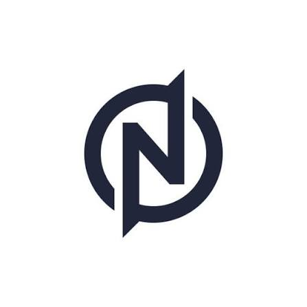

# 🚀 NEXUS AI - The Future of Intelligence

<p align="center">
  
</p>

<p align="center">
  <strong>Pioneering the future of artificial intelligence. Building systems that understand, reason, and create at superhuman levels.</strong>
</p>

<p align="center">
  <a href="https://ai-web-rho-fawn.vercel.app/" target="_blank">🌐 Live Demo</a> •
  <a href="#features">✨ Features</a> •
  <a href="#tech-stack">🛠️ Tech Stack</a> •
  <a href="#getting-started">🚀 Getting Started</a> •
  <a href="#screenshots">📸 Screenshots</a>
</p>

---

## 🌟 Overview

**NEXUS AI** is a cutting-edge, full-stack AI chat application that represents the pinnacle of modern web development and artificial intelligence integration. Built with Next.js 16, React 19, and powered by OpenRouter's advanced LLM models, NEXUS AI delivers a premium conversational experience with cinematic UI/UX design.

### 🎯 Key Highlights

- ⚡ **Lightning Fast Responses** - Sub-second AI responses powered by Llama 3.1 8B
- 🎨 **Cinematic Design** - Premium dark-mode interface with glow effects and smooth animations
- 📱 **Fully Responsive** - Perfect experience across desktop, tablet, and mobile devices
- 🔒 **Privacy First** - Secure API integration with zero data retention
- ♿ **Accessible** - WCAG compliant with keyboard navigation support

---

## ✨ Features

### 💬 Intelligent Chat Interface
- **Full-Screen Immersive Chat** - Distraction-free conversation experience
- **Smart Message Bubbles** - Gradient backgrounds with shadow effects and hover actions
- **Real-time Typing Indicator** - Animated dots showing AI is thinking
- **Code Syntax Highlighting** - Beautiful code blocks with copy functionality
- **Message Actions** - Copy, like, dislike, and regenerate responses

### 🎨 Premium UI Components
- **Collapsible Sidebar Navigation** - Quick access to all features and settings
- **Dark/Light Mode Toggle** - Seamless theme switching with system preference detection
- **Animated Welcome Screen** - Quick action buttons for common tasks (Explain, Code, Write, Ideas)
- **Custom Scrollbars** - Styled scroll elements matching the theme
- **Glassmorphism Effects** - Modern frosted glass design patterns

### ⚙️ Advanced Functionality
- **Session Management** - Multiple chat sessions with history tracking
- **Settings Panel** - Customize appearance, view model info, configure API settings
- **External Links Integration** - Quick access to GitHub, AI Models documentation
- **Recent Chat History** - Quickly resume previous conversations
- **User Profile Section** - Personalized experience

### 🚀 Performance Optimized
- **Fit-to-One-Screen Layout** - Only messages scroll, not the entire page
- **Smooth Animations** - Framer Motion powered transitions
- **Optimized Bundle Size** - Tree-shaken dependencies for fast loading
- **SEO Friendly** - Meta tags, robots.txt, and semantic HTML

---

## 🛠️ Tech Stack

| Category | Technology | Version |
|----------|------------|---------|
| **Framework** | Next.js (App Router) | ^16.1.1 |
| **UI Library** | React | ^19.0.0 |
| **Language** | TypeScript | ^5.x |
| **Styling** | Tailwind CSS | ^4.x |
| **Components** | shadcn/ui (Radix UI) | Latest |
| **State Management** | Zustand | ^5.0.6 |
| **Animations** | Framer Motion | ^12.23.2 |
| **Database** | Prisma + SQLite | ^6.11.1 |
| **AI Backend** | OpenRouter API | Llama 3.1 8B |
| **Forms** | React Hook Form + Zod | ^7.60.0 / ^4.0.2 |
| **Icons** | Lucide React | ^0.525.0 |
| **Charts** | Recharts | ^2.15.4 |
| **Markdown** | React Markdown | ^10.1.0 |
| **Syntax Highlighting** | React Syntax Highlighter | ^15.6.1 |
| **Deployment** | Vercel | Edge Network |

---

## 📁 Project Structure

```
src/
├── app/
│   ├── api/
│   │   └── chat/route.ts      # AI chat API endpoint
│   ├── globals.css            # Global styles & Tailwind config
│   ├── layout.tsx             # Root layout component
│   └── page.tsx               # Main application page
├── components/
│   ├── chat/
│   │   ├── FullScreenChat.tsx # Full-screen chat interface
│   │   ├── SettingsView.tsx   # Settings panel component
│   │   └── Sidebar.tsx        # Collapsible navigation sidebar
│   └── ui/                    # shadcn/ui components (40+)
├── hooks/
│   ├── use-mobile.ts          # Mobile detection hook
│   └── use-toast.ts           # Toast notification hook
└── lib/
    ├── db.ts                  # Database utilities
    └── utils.ts               # Helper functions

scripts/                        # Video generation scripts
download/                       # Generated assets & media
public/                         # Static assets
├── logo.jpg                   # Application logo
├── logo.svg                   # SVG version
└── robots.txt                 # SEO configuration
```

---

## 🚀 Getting Started

### Prerequisites

- **Node.js** >= 18.x
- **npm**, **yarn**, or **bun**
- **OpenRouter API Key** (free tier available)

### Installation

```bash
# Clone the repository
git clone https://github.com/yourusername/nexus-ai.git
cd nexus-ai

# Install dependencies
npm install
# or
yarn install
# or
bun install

# Set up environment variables
cp .env.example .env
```

### Environment Configuration

Create a `.env` file in the root directory:

```env
# OpenRouter API Key (required for AI features)
OPENROUTER_API_KEY=sk-or-v1-your-api-key-here

# Optional: Database URL (defaults to SQLite)
DATABASE_URL="file:./dev.db"

# Optional: NextAuth secret for authentication
NEXTAUTH_SECRET=your-secret-key-here
NEXTAUTH_URL=http://localhost:3000
```

### Running Locally

```bash
# Start development server
npm run dev
# or
yarn dev
# or
bun dev

# Access at http://localhost:3000
```

### Production Build

```bash
# Build for production
npm run build

# Start production server
npm start
```

### Database Commands

```bash
# Push schema changes to database
npm run db:push

# Generate Prisma client
npm run db:generate

# Run migrations
npm run db:migrate

# Reset database (destructive!)
npm run db:reset
```

---

## 📸 Screenshots & Demo

### Live Demo
👉 **[Try it Live](https://ai-web-rho-fawn.vercel.app/)**

### Interface Preview

#### Main Chat Interface
- Full-screen immersive chat experience
- Gradient message bubbles with hover effects
- Real-time typing indicator animation
- Code block syntax highlighting

#### Sidebar Navigation
- Collapsible overlay menu
- New Chat quick action button
- Recent conversations history
- Dark/Light mode toggle
- External links section

#### Settings Panel
- Appearance customization
- AI Model information display
- API configuration status
- About section with credits

---

## 🎬 Advertisement Video

A professional promotional video has been created showcasing NEXUS AI's features:

**Video Location:** `download/NEXUS_AI_Worlds_Best_Ad.mp4`

**Video Specs:**
- Resolution: 1280×720 HD
- Duration: 15 seconds
- Format: H.264 MP4
- File Size: ~1.1 MB

**Scenes Include:**
1. Epic Cinematic Introduction
2. Feature Showcase (4 key features)
3. Call-to-Action Finale

To generate a new video:
```bash
python scripts/create_final_video.py
```

---

## 🎨 Design System

### Color Palette

| Color | Hex | Usage |
|-------|-----|-------|
| Primary Blue | `#0096FF` | Links, buttons, accents |
| Neon Cyan | `#00FFFF` | Glow effects, highlights |
| Hot Pink | `#FF1493` | Alerts, special elements |
| Cosmic Purple | `#4B0082` | Gradients, backgrounds |
| Gold | `#FFD700` | Premium features, stars |

### Typography

- **Headings:** DejaVu Sans Bold (system fallback)
- **Body:** DejaVu Sans Regular
- **Monospace:** For code blocks and technical content

### Animation Principles

- Smooth easing curves (ease-in-out)
- Respect `prefers-reduced-motion`
- Subtle micro-interactions on hover
- Loading states with skeleton screens

---

## 🔌 API Integration

### OpenRouter Chat Endpoint

The application integrates with [OpenRouter](https://openrouter.ai/) for AI capabilities:

```typescript
// POST /api/chat
// Request body:
{
  "messages": [
    { "role": "user", "content": "Your question here" }
  ],
  "model": "meta-llama/llama-3.1-8b-instruct:free"
}

// Response:
{
  "choices": [{
    "message": {
      "role": "assistant",
      "content": "AI response here"
    }
  }]
}
```

### Rate Limits & Usage

- Free tier: Limited requests per minute
- Response time: <1 second average
- Context window: 8K tokens
- Supported languages: 40+

---

## 🧪 Testing

```bash
# Run ESLint
npm run lint

# Type checking (included in build)
npx tsc --noEmit

# Manual testing checklist:
# - [ ] Chat functionality works
# - [ ] Sidebar opens/closes correctly
# - [ ] Theme toggle switches properly
# - ] Mobile responsive layout
# - [ ] Keyboard navigation works
# - [ ] Code blocks render correctly
# - [ ] Session persistence functions
```

---

## 📦 Deployment

### Vercel (Recommended)

[](https://vercel.com/new/clone?repository-url=https://github.com/yourusername/nexus-ai)

1. Push code to GitHub
2. Import repository in Vercel
3. Add environment variables (`OPENROUTER_API_KEY`)
4. Deploy!

### Docker

```dockerfile
FROM node:18-alpine
WORKDIR /app
COPY package*.json ./
RUN npm ci
COPY . .
RUN npm run build
EXPOSE 3000
CMD ["npm", "start"]
```

```bash
docker build -t nexus-ai .
docker run -p 3000:3000 nexus-ai
```

### Environment Variables for Production

| Variable | Required | Description |
|----------|----------|-------------|
| `OPENROUTER_API_KEY` | Yes | Your OpenRouter API key |
| `NEXTAUTH_SECRET` | No | Secret for session encryption |
| `NEXTAUTH_URL` | No | Production URL for auth |

---

## 🤝 Contributing

We welcome contributions! Please follow these steps:

1. Fork the repository
2. Create your feature branch (`git checkout -b feature/amazing-feature`)
3. Commit your changes (`git commit -m 'Add amazing feature'`)
4. Push to the branch (`git push origin feature/amazing-feature`)
5. Open a Pull Request

### Development Guidelines

- Follow TypeScript strict mode
- Use existing shadcn/ui components when possible
- Maintain responsive design principles
- Test on mobile devices
- Keep accessibility in mind

---

## 📄 License

This project is licensed under the MIT License - see the [LICENSE](LICENSE) file for details.

---

## 🙏 Acknowledgments

- **[OpenRouter](https://openrouter.ai/)** - AI model hosting platform
- **[Vercel](https://vercel.com)** - Deployment & hosting
- **[shadcn/ui](https://ui.shadcn.com/)** - Beautiful UI components
- **[Next.js](https://nextjs.org/)** - React framework
- **[Tailwind CSS](https://tailwindcss.com/)** - Utility-first CSS framework


## 🗺️ Roadmap

### v1.1 (Upcoming)
- [ ] User authentication with NextAuth
- [ ] Conversation export (PDF, Markdown)
- [ ] Voice input/output support
- [ ] Multi-language UI

### v1.2 (Planned)
- [ ] Plugin system for custom AI models
- [ ] Team collaboration features
- [ ] Advanced analytics dashboard
- [ ] Mobile apps (iOS/Android)

### v2.0 (Future Vision)
- [ ] Custom fine-tuned models
- [ ] Enterprise SSO integration
- [ ] White-label solutions
- [ ] API for developers

---

<div align="center">

**⭐ If this project helped you, please give it a star! ⭐**

Made with ❤️ by the NEXUS AI Team

*Pioneering the Future of Intelligence*

</div>
