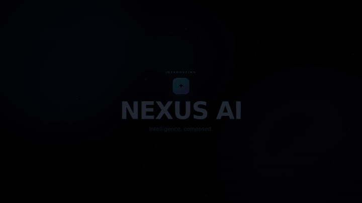

<p align="center">
  
</p>

<h1 align="center">NEXUS AI</h1>

<p align="center">
  <strong>A cinematic AI chat platform for writing, code, research, and files.</strong>
</p>

<p align="center">
  <a href="https://ai-web-rho-fawn.vercel.app"></a>
  <a href="https://nextjs.org"></a>
  <a href="https://www.typescriptlang.org"></a>
</p>

<p align="center">
  <a href="https://ai-web-rho-fawn.vercel.app">Open app</a>
  ·
  <a href="#intro-video">Intro video</a>
  ·
  <a href="#features">Features</a>
  ·
  <a href="#quick-start">Quick start</a>
  ·
  <a href="#creator">Creator</a>
</p>

## Intro video

<p align="center">
  <a href="https://github.com/atulchoudhary7781-dot/AI-web/blob/main/public/NEXUS-AI-Promo.mp4">
    
  </a>
</p>

<p align="center">
  <b>60 fps · human voice · full intro</b><br/>
  <a href="https://github.com/atulchoudhary7781-dot/AI-web/blob/main/public/NEXUS-AI-Promo.mp4">Watch on GitHub</a>
  ·
  <a href="https://github.com/atulchoudhary7781-dot/AI-web/releases/tag/intro">Release</a>
  ·
  <a href="https://ai-web-rho-fawn.vercel.app/NEXUS-AI-Promo.mp4">Play HD</a>
</p>

The promo lives in the repo at [`public/NEXUS-AI-Promo.mp4`](public/NEXUS-AI-Promo.mp4).

## Overview

NEXUS AI is a production chat product. It is built to feel fast, stay on topic, and work on every device — from a first-time guest to a signed-in daily user.

**Live:** [ai-web-rho-fawn.vercel.app](https://ai-web-rho-fawn.vercel.app)

## Features

| | |
| :--- | :--- |
| **Chat** | Working models only, topic-aware replies, related recommendations, one-tap copy |
| **Files** | Attach and analyze documents, images, and common file types |
| **Voice** | Speak-to-chat on supported devices |
| **Access** | Guest chats and a higher daily limit after login |
| **Experience** | Cinematic intro, dark UI, and a layout that stays clean on phone, tablet, and desktop |

## Pages

| Route | What it is |
| :--- | :--- |
| `/home` | Landing, promo, and founder |
| `/chat` | Full-screen AI chat |
| `/pricing` | Plans |
| `/login` · `/signup` | Account |
| `/settings` · `/profile` | Preferences |
| `/help` | FAQ |
| `/dashboard` | Overview |

## Stack

- **App** — Next.js 16, React 19, TypeScript
- **UI** — Tailwind CSS 4, Radix, Lucide
- **Data** — Prisma (optional)
- **Deploy** — Vercel

## Quick start

```bash
git clone https://github.com/atulchoudhary7781-dot/AI-web.git
cd AI-web
npm install
```

Create a `.env` file in the project root (never commit it):

```bash
OPENROUTER_API_KEY=your_key
DATABASE_URL=             # optional
```

```bash
npm run dev
```

Open [http://localhost:3000](http://localhost:3000). The app lands on **Home**.

## Project layout

```text
src/app          routes and API
src/components   chat, intro, layout, UI
src/lib          models, quota, files, helpers
public           logo, poster, promo video
docs             GitHub extras (intro preview)
```

## Notes

- Keep API keys in `.env`. They are gitignored.
- Chat stays available even if the database is not configured.
- Built to run worldwide without pinning the app to localhost.

## Creator

**Atul Choudhary** · AI Product Engineer · Delhi

He builds production AI systems — agentic workflows, RAG, and cinematic web clients. NEXUS AI is his platform.

[LinkedIn](https://www.linkedin.com/in/atul-choudhary-018037301/)

---

<p align="center">
  <sub>NEXUS AI · built with care</sub>
</p>
